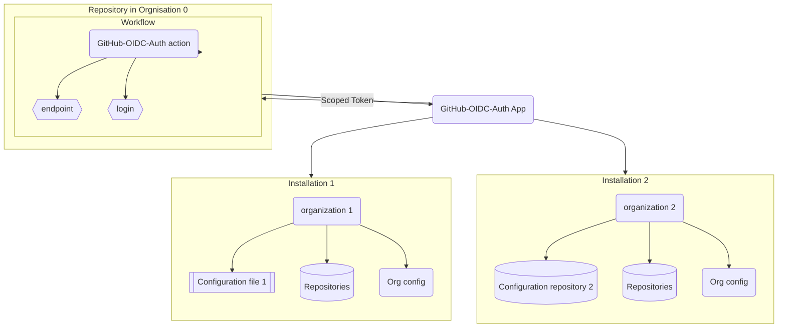

[](https://github.com/helaili/github-oidc-auth-app/actions/workflows/deploy.yml)
[](https://github.com/helaili/github-oidc-auth-app/pkgs/container/github-oidc-auth-app/97506464?tag=latest)

# github-oidc-auth-app

A GitHub App that generates a GitHub API scoped token from within an Actions workflow based on OIDC claims

# Overview
Oftentimes you need a GitHub Actions pipeline to use the GitHub API to perform some operations on another repository or organization. For example, you may want to get a container, or you may want to create a repository in a different organization. In those cases, you need to use a GitHub API token that has the right scopes. The problem is that you cannot use the automatically provided GITHUB_TOKEN as it doesn't have enough permissions, and you don't want to use a personal access token because eithe. Those are tied to a specific humand user or to a machine account, and in both case it means generating, sharing, storing, renewing... a secret.

There is already a workaround for that with the action [peter-murray/workflow-application-token-action](https://github.com/peter-murray/workflow-application-token-action), which will deliver a short lived token that will provide access to a foreign resource on GitHub. This solution is great as there is no runtime involved, it is just the configuration of a new GitHub App, but it requires to share a private key as an Actions secret with every repository that needs to use it. You have now way to audit the usage, and a key rotation will be painful. Last, a new GitHub App will be needed whenever a different scope is needed, and you have a limit of 100 apps per organization. Having said that, again, this is still the easiest and fastest solution to the problem of granting access to a foreign resource on GitHub.

Now if none of the above solutions fit your needs, this project provides a new approach. It relies on the ability to get [an OpenID Connect (OIDC) token](https://docs.github.com/en/actions/deployment/security-hardening-your-deployments/about-security-hardening-with-openid-connect) from with an Actions workflow. This token generated by GitHub contains claims (repo name, environment, actor, ref, event...) that can't be faked. Therefore we can safely pass this over to this GitHub App which will verify the claims and generate a scoped, short-lived token that can be used to access the GitHub API. This token will provide a set of permission based on a configuration file which will allow to differentiate access based on the claims. With one app deployment, a workflow in repo X can have `write` access to the content of the Foo repo, while a workflow in repo Y will have `admin` access to the Bar organization.


# Architecture


  
# Configuration

Those are the environment variables that can be used to configure the app:

`PORT`: **Required**. The port the process will listen to

`WEBHOOK_SECRET`: **Required**. The secret used to sign the webhook payloads

`PRIVATE_KEY`: **Required**. The private key of the GitHub App as base64 encoded string

`APP_ID`: **Required**. The ID of the GitHub App

`CONFIG_REPO`: **Optional**. The name of the repository where the configuration file is stored. Default to `oidc_entitlements`

`CONFIG_FILE`: **Optional**. The name of the configuration file (only when using single file mode).

`GHES_URL`: **Optional**. The URL of the GitHub Enterprise Server in the form of `https://ghes.example.com`. If not provided, the app will use `https://github.com`.

# Installation

## Create a GitHub App 

You have two options: you can go through the manual steps listed below, or make your life easy and go to [this site](https://helaili.github.io/github-oidc-auth-site/deploy) and click the deploy link. It will install the application with minimal permissions and provide you with the `APP_ID`, the `WEBHOOK_SECRET` and the base64 encoded `PRIVATE_KEY` string. You will need to provide a webhook which in certain cases will be a 🐔🥚situation, so you might need to update this later. In any case, you will most likely need to go back to the app settings from https://github.com/organizations/<your org>/settings/apps in order to fine tune the permissions granted to the app. 

⚠️ In case you are planning on installing the app on multiple organizations, make sure you set its visibility to [`public`](https://docs.github.com/en/apps/creating-github-apps/registering-a-github-app/making-a-github-app-public-or-private). 

### Manual steps

Follow [the instructions](https://docs.github.com/en/apps/creating-github-apps/setting-up-a-github-app/creating-a-github-app) to create the GitHub App. Couple things to keep in mind while creating this app:
- You need to set permissions for this app. This permissions need to be the sum of permissions of all the scoped tokens you intend to generate. You might have to review this list of permissions if you want to add a new scope later on. At minimum, it should have the `contents:read` permission and subsribe to the `push` event so that the cached configuration can be updated when it changes. 
- The webhook URL should be `https://<your url>/webhook`. 
- There is no need to set a setup URL or a callback URL. You have to provide a homepage URL, but it can be anything as it will not be used.
- If you are going to use this app beyond the organization or account that owns the app, make sure to select the `Any account` option in the `Where can this GitHub App be installed?` section. In other words, if you are going to use the app to grant access to a repository in another organization than the owner of the app, you need to select `Any account` and not `Only on this account`.
- Note the `App ID` of the app, you will need to provide later as an environment variable to the app runtime.
- Set a webhook secret. This secret will be provided as an environment variable to the app runtime.
- Once the application created, generate a private key for this app. You can do that in the `General` section of the app settings. This key is highly confidential and will be provided as a base64 encoded string as an environment variable to the app runtime. You can use the following command to generate the base64 encoded string of the private key:

```bash
cat private-key.pem | base64
```

## Deploy the app
- Deploy the app as a runtime built with command `make build` or using [the docker container](https://github.com/helaili/github-oidc-auth-app/pkgs/container/github-oidc-auth-app).
- Configure the app with the environment variables described above. These variables are at minimum `PORT`, `WEBHOOK_SECRET`, `PRIVATE_KEY` and `APP_ID`.
- You can test the app by hitting the `/ping` endpoint. You should get a `Ok` response.

## Install the app
- Install the app on each organizations that will need to be accessed by the workflows. You can do that by following [the instructions](https://docs.github.com/en/apps/maintaining-github-apps/installing-github-apps). Remember to select the repositories that will accessed by the app, including the one that will host the `oidc_entitlements.json` configuration file.

## Create a configuration 

### Repository based configuration

This is the prefered option as it allows to create more advanced approval workflows based on `CODEOWNERS` files.

Within a dedicated repo (defaults to `oidc_entitlements`, otherwise set the `CONFIG_REPO` environment variable accordingly), each JSON file defines a single entitlement, and the folder hierarchy implies a semantic that constrains the content. This means that the folder name will override the eventual matching setting in the file. For example, let's take a file `permission.json` in the `repositories/codespace-oddity/environments/production/owners/major-tom/repositories/starman` folder:

```json
{
  "workflow": "Manual Test Workflow",
  "scopes": {
    "permissions": {
      "contents": "write",
    }
  }
}
```

It will be equivalent to the file below stored at the root of the repository. 

```json
{
  "repository":       "major-tom/starman",
	"repository_owner": "major-tom",
	"environment":      "production",
  "workflow":         "Manual Test Workflow",
  "scopes": {
    "repositories": [
      "codespace-oddity"
    ],
    "permissions": {
      "contents": "write",
    }
  }
}
```

This configuration will grant `write` access to the `codespace-oddity` repository for the jobs targeting the production environment within the workflow `Manual Test Workflow` of the `starman` repository owned by `major-tom`.


#### Semantic
- `owners`: each subfolder defines the name of an organization or a user owning a worflow that can request a scoped token.
- `repositories` when following an `owners` defininition (i.e. `.../owners/major-tom/repositories/starman`): each subfolder defines the name of a repository (within the organization or user) owning a worflow that can request a scoped token.
- `repositories` when not following an `owners` definition: each subfolder defines the name of the repository within the organization where the app is installed which will be accessible with the scoped token. The app needs to have access to the repository in order to be able to create a scoped token for it.
- `environments`: each subfolder defines the name of an environment (e.g. `development`, `production`, `staging`, etc.) targeted by the job requesting the scoped token.
- `organization`: each subfolder defines the name of an organization level permission that will be granted to the scoped token. The name of the folder will be used to build the name of the permission. For example, if the folder is named `administration`, the permission will be `organization_administration`. See the the `properties of permissions` section [here](https://docs.github.com/en/enterprise-cloud@latest/rest/apps/apps?apiVersion=2022-11-28#create-a-scoped-access-token) to see the list of permissions and their values.

Notes: 
- A file at the root of the repo can defined any permissions for any claim. 
- only files under an `organizations` folder can defined an organization level permission.
- files under an `organizations` folder can not povide permissions to a repository.
- files directly under folders `organizations`, `repositories`, `environments` or `owners` are ignored.
- semantic folders can be nested in any order (except for `owners` and `repositories` which need to be in that order when defining the source repository).

Sample folder hierarchy:

```
repo/
├─ organization/
│  ├─ administration/
│  │  ├─ owners/
│  │  │  ├─ ziggy-stardust/
│  │  │  ├─ major-tom/
│  │  │  │  ├─ environments/
│  │  │  │  │  ├─ development/
│  │  │  │  │  ├─ production/
│  │  │  │  │  │  ├─ org-perm-major-tom-production.json
│  │  │  │  ├─ repositories/
│  │  │  │  │  ├─ starman/
│  │  │  │  │  │  ├─ org-perm-major-tom-starman.json
│  ├─ custom_roles/
├─ repositories/
│  ├─ codespace-oddity/
│  │  ├─ owners/
│  │  │  ├─ ziggy-stardust/
│  │  │  ├─ major-tom/
│  │  │  │  ├─ environments/
│  │  │  │  │  ├─ development/
│  │  │  │  │  ├─ production/
│  │  │  │  │  │  ├─ repo-perm-major-tom-production.json
│  │  │  │  ├─ repositories/
│  │  │  │  │  ├─ starman/
│  │  │  │  │  │  ├─ repo-perm-major-tom-starman-1.json
│  │  │  │  │  │  ├─ repo-perm-major-tom-starman-2.json
│  │  │  │  ├─ repo-perm-major-tom.json
│  │  ├─ repo-perm-codespace-oddity-1.json
│  │  ├─ repo-perm-codespace-oddity-2.json
│  ├─ commit-on-mars/ 
├─ generic.json
├─ README.md
```

#### File content
The content of the file is a JSON object listing the claims to match and the permissions to grant if the claims match.
```json
{
    "claim 1": "value 1",
    "claim 2": "value 2",
    "claim 3": "value 3",
    "scopes": {
        "repositories": [
            "repo I will get access to 1",
            "repo I will get access to 2"
        ],
        "permissions": [
            "permsission I will be granted with",
            "permsission I will be granted with"
        ]
    }
}
```

Sample file content:
```json
{
    "workflow": "My first worlflow",
    "repository": "ziggy/stardust",
    "scopes": {
        "repositories": [
            "codespace-oddity"
        ],
        "permissions": {
            "contents": "write",
            "checks": "write",
            "administration": "read"
        }
    }
}
```

### Single file configuration

In this mode, the whole configuration is stored in a single file. Commit a JSON file in the repository and set the `CONFIG_REPO` and `CONFIG_FILE` environment variables accordingly. The file should look like below. It is a basically an array of claims to match and the permissions to grant if the claim matches. The claims are the ones provided by the OIDC token and represent properties of the GitHub Actions workflow (along with information about actor, repo, commit...) which needs to retrieve the scoped token. 

```json
[
    {
        "claim 1": "value 1",
        "claim 2": "value 2",
        "claim 3": "value 3",
        "scopes": {
            "repositories": [
                "repo I will get access to 1",
                "repo I will get access to 2"
            ],
            "permissions": [
                "permsission I will be granted with",
                "permsission I will be granted with"
            ]
        }
    }
]
```

Sample file content:
```json
[
    {
        "workflow": "My first worlflow",
        "repository": "ziggy/stardust",
        "scopes": {
            "repositories": [
                "codespace-oddity"
            ],
            "permissions": {
                "contents": "write",
                "checks": "write",
                "administration": "read"
            }
        }
    },
    {
        "environment": "production",
        "repository_owner": "talkingheads",
        "repository_visibility": "public",
        "scopes": {
            "repositories": [
                "codespace-oddity"
            ],
            "permissions": {
                "contents": "write"
            }
        }
    },
    {
        "repository_owner": "talkingheads",
        "repository": "talkingheads/road-to-nowhere",
        "scopes": {
            "repositories": [
                "starman"
            ],
            "permissions": {
                "contents": "read",
                "organization_administration": "write"
            }
        }
    }
]
```
 
 If a set of claim matches several entries, the permissions will be the sum of the permissions of all the matching entries. For instance, a job from the `talkingheads/road-to-nowhere` `public` repository targeting the `production` environment will get the entitlements below which are the sum of the two matching configuration objects from the array above.
 
 
 ```json
{
    "repositories": [
        "codespace-oddity",
        "starman"
    ],
    "permissions": {
        "contents": "write",
        "organization_administration": "write"
    }
}
 ```

### Set App permissions

Remember that the app you created needs to have the permissions of all the different scoped tokens it will generate. Therefore, with the configuration above, the app  will need to have the following permissions:
```yaml
contents: write
checks: write
administration: read
organization_administration: write
```

The list of claims currently supported by this app is currently limited to the list below. See the [GitHub documentation](https://docs.github.com/en/enterprise-cloud@latest/actions/deployment/security-hardening-your-deployments/about-security-hardening-with-openid-connect#configuring-the-oidc-trust-with-the-cloud) for more details about the meaning of these claims.
- actor
- actor_id
- aud
- base_ref
- environment
- event_name
- head_ref
- job_workflow_ref
- job_workflow_sha
- ref
- ref_type
- repository
- repository_id
- repository_owner
- repository_owner_id
- repository_visibility
- run_id
- run_number
- run_attempt
- runner_environment
- sub
- workflow
- workflow_ref
- workflow_sha


:rotating_light: **Important**: If you set loose claim filters in your configuration (like just `environment: production`), anyone with one of the login name and the URL of the app will be able to generate a token with the matching permission. Using such loose conditions means you need to treat these paramaters as secrets, but I would strongly advise to always include extra information that can not be faked such as the repository owner name.

See the the `properties of permissions` section [here](https://docs.github.com/en/enterprise-cloud@latest/rest/apps/apps?apiVersion=2022-11-28#create-a-scoped-access-token) to see the list of permissions and their values.

:rotating_light: **Important**: Don't forget to update the app permissions anytime you change this configuration. You might need to remove or add some permissions. 

## Use the action
The companion action [`helaili/github-oidc-auth`](https://github.com/helaili/github-oidc-auth) will retrieve the scoped token. It needs two inputs:
- `endpoint`: this is the URL of the `/token` endpoint of the app you deployed above. It should look like `https://my-app.com/token`.
- `login`: this is the login name of the organization or user that will be accessed with the scoped token. The app should have been installed on this account.


```yaml
should-work-with-action:
    ...
    permissions:
      id-token: write
    steps:
      - name: GetToken
        id: getToken
        uses: helaili/github-oidc-auth@main
        with:
          login: ${{ vars.login }}
          endpoint: ${{ vars.endpoint }}
      - name: Use the token from the environment
        uses: actions/github-script@v6
        with:
          github-token: ${{ env.SCOPED_TOKEN }}
        ...   
      - name: Use the token from the step output
        uses: actions/github-script@v6
        with:
          github-token: ${{ steps.getToken.outputs.scopedToken }}

        ...
```

# Giving it a try

You might to give this app and action a try without going through the hassle of creating a new GitHub app and deploying it somewhere. Make sense, so I created a sandbox for you. This is a sandbox, there is no SLA coming with this and as I am running it, it really means that you are trusting me with your GitHub token. I am not going to do anything bad with it, but you should not use this for anything serious. In order to limit any problem,  no organization permission are granted to this app instance. The only repository permissions granted are:
- administration: `read`
- contents: `write`
- issues: `write`

In order to use this sandbox, you will need to:
- Create a repository named `oidc_entitlements` in your organization as previously explained. 
- Install the app on your organization by clicking [here](https://github.com/apps/oidc-auth-for-github-sandbox). Make sure you grant the app access to at least the `oidc_entitlements` repository and whichever other one within this organization that you will want to access using the token. 
- Create a workflow that uses the action `helaili/github-oidc-auth` as shown below. 

```yaml
...
    steps:
      - name: Get the token
        id: getToken
        uses: helaili/github-oidc-auth@main
        with:
          login: < organization or user login which you need access to >
          endpoint: https://oidc-auth-app-sandbox.whitefield-370b64fc.eastus.azurecontainerapps.io/token

      - name: Use the token from the output
        uses: actions/github-script@v6
        with:
          github-token: ${{ steps.getToken.outputs.scopedToken }}
          script: |
            github.rest.repos.get({
              owner: 'my-org',
              repo: 'my-repo'
            }).then((response) => {
              if(!response.data.full_name === 'my-org/my-repo') {
                // Victory!
              }
            }).catch((error) => {
              core.setFailed(`Failed to access repo. Error was ${error}`);
            })
```

# Credits

This app shamelessly reuses code from https://github.com/github/actions-oidc-gateway-example. Thanks to [@steiza](https://github.com/steiza) for the inspiration!
